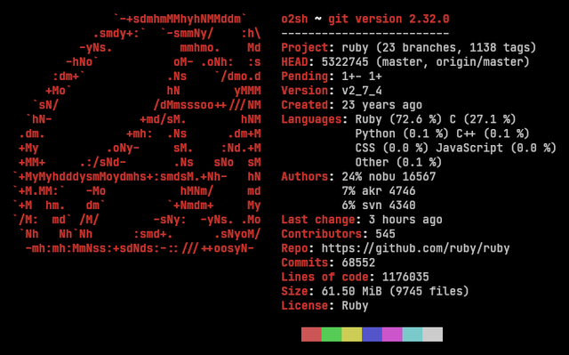

 

# Ruby 💎

Ruby is a language of careful balance. Its creator, Yukihiro “Matz” Matsumoto, blended parts of his favorite languages (Perl, Smalltalk, Eiffel, Ada, and Lisp) to form a new language that balanced functional programming with imperative programming.  

He has often said that he is “trying to make Ruby natural, not simple,” in a way that mirrors life.  

> Ruby is simple in appearance, but is very complex inside, just like our human body1.  
> -Yukihiro "Matz" Matsumoto.  

  

_Table of contents_  

1. [Basic Syntax](basics/basic_syntax.md)
    - [Begin-end](basics/begin_end.rb)
    - [Loop](basics/loops_types.rb)
    - [If and Else Statement](basics/if_statement.rb)
    - [Class And Functions](basics/class_and_functions.rb)
    - [regex with ruby](basics/regex_.rb)
    - [keywords](basics/ruby_keywords.txt)

2. [Some tips]()

